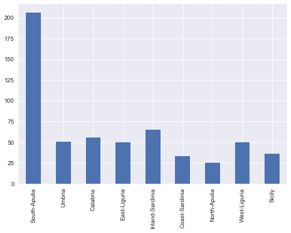
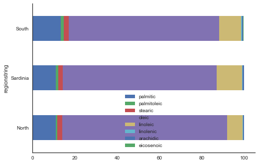
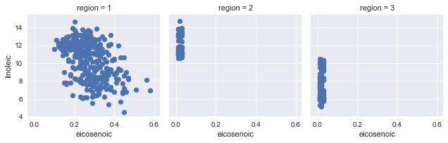

## Contents
{:.no_toc}
*  
{: toc}


```python
%matplotlib inline
import numpy as np
import matplotlib.pyplot as plt
import pandas as pd
import seaborn as sns
pd.set_option('display.width', 500)
pd.set_option('display.max_columns', 100)
```


## Italian Olives


I found this data set in the RGGobi book (http://www.ggobi.org/book/), from which the above diagram is taken. It has "the percentage composition of fatty acids
found in the lipid fraction of Italian olive oils', with oils from 3 regions of Italy: the North, the South, and Sardinia. The regions themselves are subdivided into areas as shown in the map above. The source for this data is:

>Forina, M., Armanino, C., Lanteri, S. & Tiscornia, E. (1983), Classification of Olive Oils from their Fatty Acid Composition, in Martens, H. and
Russwurm Jr., H., eds, Food Research and Data Analysis, Applied Science
Publishers, London, pp. 189–214.

## Exploratory Viz


```python
df = pd.read_csv("local-olives-cleaned.csv")
df.head()
```


<div>
<style>
    .dataframe thead tr:only-child th {
        text-align: right;
    }

    .dataframe thead th {
        text-align: left;
    }

    .dataframe tbody tr th {
        vertical-align: top;
    }
</style>
<table border="1" class="dataframe">
  <thead>
    <tr style="text-align: right;">
      <th></th>
      <th>areastring</th>
      <th>region</th>
      <th>area</th>
      <th>palmitic</th>
      <th>palmitoleic</th>
      <th>stearic</th>
      <th>oleic</th>
      <th>linoleic</th>
      <th>linolenic</th>
      <th>arachidic</th>
      <th>eicosenoic</th>
      <th>regionstring</th>
    </tr>
  </thead>
  <tbody>
    <tr>
      <th>0</th>
      <td>North-Apulia</td>
      <td>1</td>
      <td>1</td>
      <td>10.75</td>
      <td>0.75</td>
      <td>2.26</td>
      <td>78.23</td>
      <td>6.72</td>
      <td>0.36</td>
      <td>0.60</td>
      <td>0.29</td>
      <td>South</td>
    </tr>
    <tr>
      <th>1</th>
      <td>North-Apulia</td>
      <td>1</td>
      <td>1</td>
      <td>10.88</td>
      <td>0.73</td>
      <td>2.24</td>
      <td>77.09</td>
      <td>7.81</td>
      <td>0.31</td>
      <td>0.61</td>
      <td>0.29</td>
      <td>South</td>
    </tr>
    <tr>
      <th>2</th>
      <td>North-Apulia</td>
      <td>1</td>
      <td>1</td>
      <td>9.11</td>
      <td>0.54</td>
      <td>2.46</td>
      <td>81.13</td>
      <td>5.49</td>
      <td>0.31</td>
      <td>0.63</td>
      <td>0.29</td>
      <td>South</td>
    </tr>
    <tr>
      <th>3</th>
      <td>North-Apulia</td>
      <td>1</td>
      <td>1</td>
      <td>9.66</td>
      <td>0.57</td>
      <td>2.40</td>
      <td>79.52</td>
      <td>6.19</td>
      <td>0.50</td>
      <td>0.78</td>
      <td>0.35</td>
      <td>South</td>
    </tr>
    <tr>
      <th>4</th>
      <td>North-Apulia</td>
      <td>1</td>
      <td>1</td>
      <td>10.51</td>
      <td>0.67</td>
      <td>2.59</td>
      <td>77.71</td>
      <td>6.72</td>
      <td>0.50</td>
      <td>0.80</td>
      <td>0.46</td>
      <td>South</td>
    </tr>
  </tbody>
</table>
</div>


### exploring globally


```python
pd.crosstab(df.areastring, df.regionstring)
```


<div>
<style>
    .dataframe thead tr:only-child th {
        text-align: right;
    }

    .dataframe thead th {
        text-align: left;
    }

    .dataframe tbody tr th {
        vertical-align: top;
    }
</style>
<table border="1" class="dataframe">
  <thead>
    <tr style="text-align: right;">
      <th>regionstring</th>
      <th>North</th>
      <th>Sardinia</th>
      <th>South</th>
    </tr>
    <tr>
      <th>areastring</th>
      <th></th>
      <th></th>
      <th></th>
    </tr>
  </thead>
  <tbody>
    <tr>
      <th>Calabria</th>
      <td>0</td>
      <td>0</td>
      <td>56</td>
    </tr>
    <tr>
      <th>Coast-Sardinia</th>
      <td>0</td>
      <td>33</td>
      <td>0</td>
    </tr>
    <tr>
      <th>East-Liguria</th>
      <td>50</td>
      <td>0</td>
      <td>0</td>
    </tr>
    <tr>
      <th>Inland-Sardinia</th>
      <td>0</td>
      <td>65</td>
      <td>0</td>
    </tr>
    <tr>
      <th>North-Apulia</th>
      <td>0</td>
      <td>0</td>
      <td>25</td>
    </tr>
    <tr>
      <th>Sicily</th>
      <td>0</td>
      <td>0</td>
      <td>36</td>
    </tr>
    <tr>
      <th>South-Apulia</th>
      <td>0</td>
      <td>0</td>
      <td>206</td>
    </tr>
    <tr>
      <th>Umbria</th>
      <td>51</td>
      <td>0</td>
      <td>0</td>
    </tr>
    <tr>
      <th>West-Liguria</th>
      <td>50</td>
      <td>0</td>
      <td>0</td>
    </tr>
  </tbody>
</table>
</div>


```python
pd.value_counts(df.areastring, sort=False).plot(kind="bar");
```





```python
pd.value_counts(df.regionstring, sort=False).plot(kind="barh");
```


```python
acidlist=['palmitic', 'palmitoleic', 'stearic', 'oleic', 'linoleic', 'linolenic', 'arachidic', 'eicosenoic']
df[acidlist].median().plot(kind="bar");
```


Or one can use `aggregate` to pass an arbitrary function of to the sub-dataframe. The function is applied columnwise.


```python
dfbymean=df.groupby("regionstring").aggregate(np.mean)
dfbymean.head()
```


<div>
<style>
    .dataframe thead tr:only-child th {
        text-align: right;
    }

    .dataframe thead th {
        text-align: left;
    }

    .dataframe tbody tr th {
        vertical-align: top;
    }
</style>
<table border="1" class="dataframe">
  <thead>
    <tr style="text-align: right;">
      <th></th>
      <th>region</th>
      <th>area</th>
      <th>palmitic</th>
      <th>palmitoleic</th>
      <th>stearic</th>
      <th>oleic</th>
      <th>linoleic</th>
      <th>linolenic</th>
      <th>arachidic</th>
      <th>eicosenoic</th>
    </tr>
    <tr>
      <th>regionstring</th>
      <th></th>
      <th></th>
      <th></th>
      <th></th>
      <th></th>
      <th></th>
      <th></th>
      <th></th>
      <th></th>
      <th></th>
    </tr>
  </thead>
  <tbody>
    <tr>
      <th>North</th>
      <td>3.0</td>
      <td>8.006623</td>
      <td>10.948013</td>
      <td>0.837351</td>
      <td>2.308013</td>
      <td>77.930530</td>
      <td>7.270331</td>
      <td>0.217881</td>
      <td>0.375762</td>
      <td>0.019735</td>
    </tr>
    <tr>
      <th>Sardinia</th>
      <td>2.0</td>
      <td>5.336735</td>
      <td>11.113469</td>
      <td>0.967449</td>
      <td>2.261837</td>
      <td>72.680204</td>
      <td>11.965306</td>
      <td>0.270918</td>
      <td>0.731735</td>
      <td>0.019388</td>
    </tr>
    <tr>
      <th>South</th>
      <td>1.0</td>
      <td>2.783282</td>
      <td>13.322879</td>
      <td>1.548019</td>
      <td>2.287740</td>
      <td>71.000093</td>
      <td>10.334985</td>
      <td>0.380650</td>
      <td>0.631176</td>
      <td>0.273220</td>
    </tr>
  </tbody>
</table>
</div>


```python
with sns.axes_style("white", {'grid':False}):
    dfbymean[acidlist].plot(kind='barh', stacked=True);
    sns.despine()
```





## Figuring the dataset by Region


```python
g=sns.FacetGrid(df, col="region")
g.map(plt.scatter,"eicosenoic", "linoleic");
```





Clearly, region 1 or the South can visually be separated out by `eicosenoic` fraction itself.


```python
with sns.axes_style("white"):
    g=sns.FacetGrid(df, col="region")
    g.map(sns.distplot, "eicosenoic")
```


We make a SPLOM using `seaborn` to see in what space the regions may be separated. Note that linoleic and oleic seem promising. And perhaps arachidic paired with eicosenoic.


```python
sns.pairplot(df, vars=acidlist, hue="regionstring", size=2.5, diag_kind='kde');
```


Pandas supports conditional indexing: <a href="http://pandas.pydata.org/pandas-docs/dev/indexing.html#boolean-indexing">documentation</a>. Lets use it to follow up on the clear pattern of Southern oils seeeming to be separable by just the `eicosenoic` feature.

**Indeed this is the case!** Can also be seen using parallel co-ordinates:


```python
from pandas.tools.plotting import parallel_coordinates
dfna=df[acidlist]
#normalizing by range
dfna_norm = (dfna - dfna.mean()) / (dfna.max() - dfna.min())
with sns.axes_style("white"):
    parallel_coordinates(df[['regionstring']].join(dfna_norm), 'regionstring', alpha=0.3)
```


## Figuring the South of Italy by Area


```python
dfsouth=df[df.regionstring=='South']
dfsouth.head()
```


<div>
<style>
    .dataframe thead tr:only-child th {
        text-align: right;
    }

    .dataframe thead th {
        text-align: left;
    }

    .dataframe tbody tr th {
        vertical-align: top;
    }
</style>
<table border="1" class="dataframe">
  <thead>
    <tr style="text-align: right;">
      <th></th>
      <th>areastring</th>
      <th>region</th>
      <th>area</th>
      <th>palmitic</th>
      <th>palmitoleic</th>
      <th>stearic</th>
      <th>oleic</th>
      <th>linoleic</th>
      <th>linolenic</th>
      <th>arachidic</th>
      <th>eicosenoic</th>
      <th>regionstring</th>
    </tr>
  </thead>
  <tbody>
    <tr>
      <th>0</th>
      <td>North-Apulia</td>
      <td>1</td>
      <td>1</td>
      <td>10.75</td>
      <td>0.75</td>
      <td>2.26</td>
      <td>78.23</td>
      <td>6.72</td>
      <td>0.36</td>
      <td>0.60</td>
      <td>0.29</td>
      <td>South</td>
    </tr>
    <tr>
      <th>1</th>
      <td>North-Apulia</td>
      <td>1</td>
      <td>1</td>
      <td>10.88</td>
      <td>0.73</td>
      <td>2.24</td>
      <td>77.09</td>
      <td>7.81</td>
      <td>0.31</td>
      <td>0.61</td>
      <td>0.29</td>
      <td>South</td>
    </tr>
    <tr>
      <th>2</th>
      <td>North-Apulia</td>
      <td>1</td>
      <td>1</td>
      <td>9.11</td>
      <td>0.54</td>
      <td>2.46</td>
      <td>81.13</td>
      <td>5.49</td>
      <td>0.31</td>
      <td>0.63</td>
      <td>0.29</td>
      <td>South</td>
    </tr>
    <tr>
      <th>3</th>
      <td>North-Apulia</td>
      <td>1</td>
      <td>1</td>
      <td>9.66</td>
      <td>0.57</td>
      <td>2.40</td>
      <td>79.52</td>
      <td>6.19</td>
      <td>0.50</td>
      <td>0.78</td>
      <td>0.35</td>
      <td>South</td>
    </tr>
    <tr>
      <th>4</th>
      <td>North-Apulia</td>
      <td>1</td>
      <td>1</td>
      <td>10.51</td>
      <td>0.67</td>
      <td>2.59</td>
      <td>77.71</td>
      <td>6.72</td>
      <td>0.50</td>
      <td>0.80</td>
      <td>0.46</td>
      <td>South</td>
    </tr>
  </tbody>
</table>
</div>


We make a couple of SPLOM's, one with sicily and one without sicily, to see whats separable. Sicily seems to be a problem. As before, see the KDE's first to see if separability exists and then let the eye look for patterns.


```python
sns.pairplot(dfsouth, hue="areastring", size=2.5, vars=acidlist, diag_kind='kde');
```


```python
sns.pairplot(dfsouth[dfsouth.areastring!="Sicily"], hue="areastring", size=2.5, vars=acidlist, diag_kind='kde');
```


Seems that combinations of oleic, palmitic, palmitoleic might be useful?
